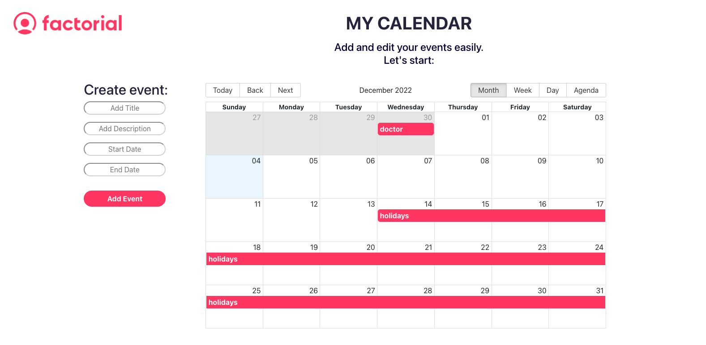

# My Calendar

Application to create and edit events in a calendar.

## Author

- [@orealba](https://github.com/Orealba)

## The project contains

- Several components created in React to be used in different pages.
- Files in React and CCS.
- It contains a header with a logo, an area to create events and the calendar where the events are reflected.
- There are two pages, one to add the event and one to edit the event.

### `npm run start`

Runs the app in the development mode.\
Open [http://localhost:3000](http://localhost:3000) to view it in your browser.

The page will reload when you make changes.\
You may also see any lint errors in the console.

